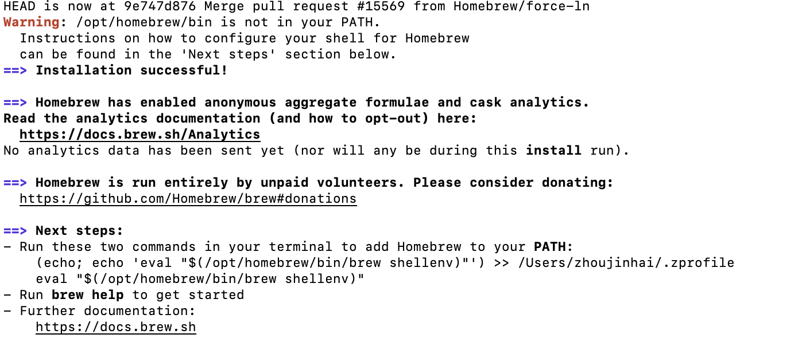

## Homebrew

Homebrew是一款Mac OS平台下的软件包管理工具，拥有安装、卸载、更新、查看、搜索等很多实用的功能。简单的一条指令，就可以实现包管理，而不用你关心各种依赖和文件路径的情况，十分方便快捷。

### 安装

网址：https://brew.sh/

安装命令：
```
/bin/bash -c "$(curl -fsSL https://raw.githubusercontent.com/Homebrew/install/HEAD/install.sh)"
```

如果显示443错误，把电脑DNS更改为8.8.8.8即可。   

### 安装成功显示


### next steps
```
echo 'eval $(/opt/homebrew/bin/brew shellenv)' >> /Users/zhoujinhai/.zprofile
eval $(/opt/homebrew/bin/brew shellenv)
```

### Homebrew可用包列表及常用命令

https://formulae.brew.sh/formula/

常用命令
```
$ brew install wget  //安装包
$ brew uninstall <packageName>   //卸载包
$ brew search <packageName>  //搜索包
$ brew list  //查看所有包
$ brew update   //更新Homebrew
$ brew -v   //查看Homebrew版本s
$ brew clearnup <packageName> //清理命令
```

## NPM是什么
NPM 的全称是 Node Package Manager，是随同 NodeJS 一起安装的包管理和分发工具，它很方便让 JavaScript 开发者下载、安装、上传以及管理已经安装的包。

```
npm install -g npm@9.7.1   //更新
```

## 安装 Hexo 及主题

### 安装步骤
网址：https://hexo.io/zh-cn/docs/

1、打开控制台；
2、输入安装命令：`npm install hexo-cli -g`
3、`cd` 进入到你需要安装博客的目录
4、`hexo init <博客目录名称如：mynote>`
5、输入 `cd my_blog`
6、输入 `npm install`
7、输入 `hexo server`

显示以下提示即可本地访问：http://localhost:4000/

### 主题安装
示例主题：butterfly - https://github.com/jerryc127/hexo-theme-butterfly/releases/tag/4.9.0


#### 安装
在你的Hexo根目录里运行
clone -b master https://github.com/jerryc127/hexo-theme-butterfly.git themes/butterfly

#### 应用主题
修改 Hexo 根目錄下的 `_config.yml`，把主題改為 butterfly

#### 安装插件
如果你沒有 pug 以及 stylus 的渲染器，請下載安裝
```
npm install hexo-renderer-pug hexo-renderer-stylus --save
```
#### 清除缓存
```
hexo clean
hexo g
hexo s
```